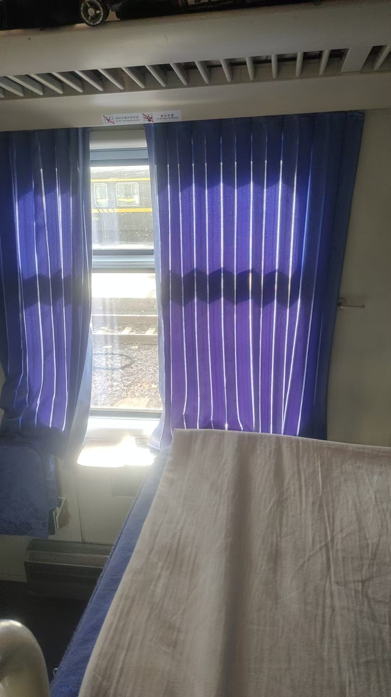
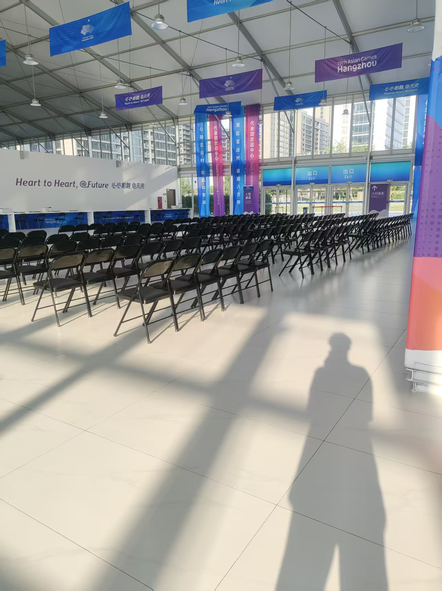
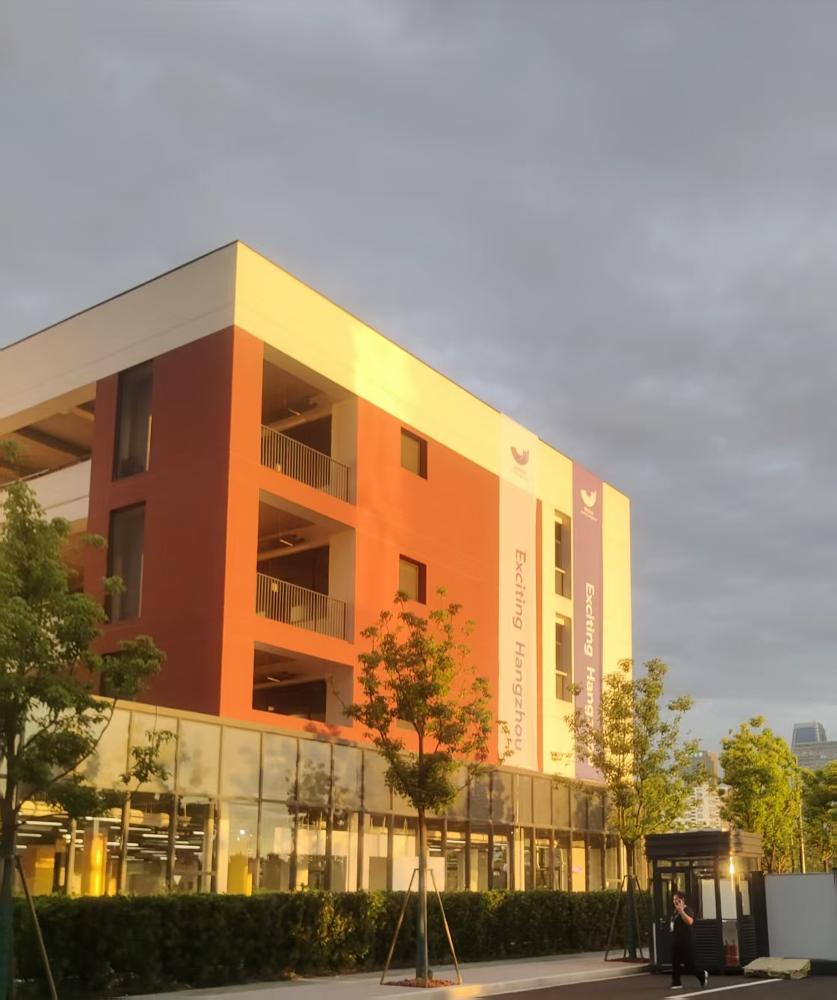
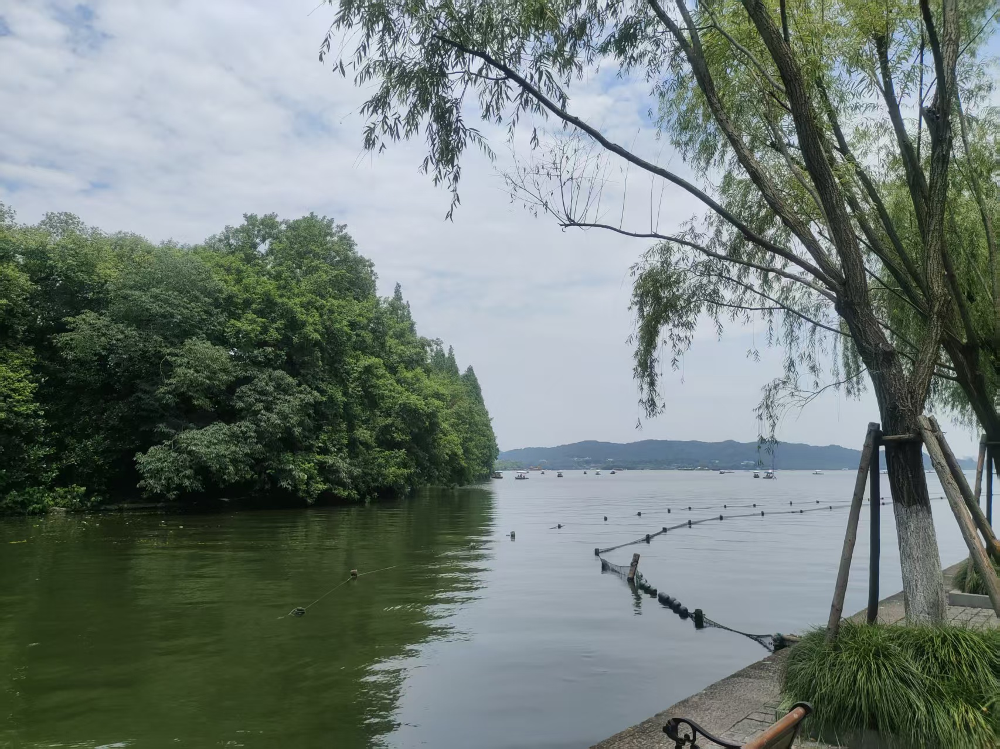
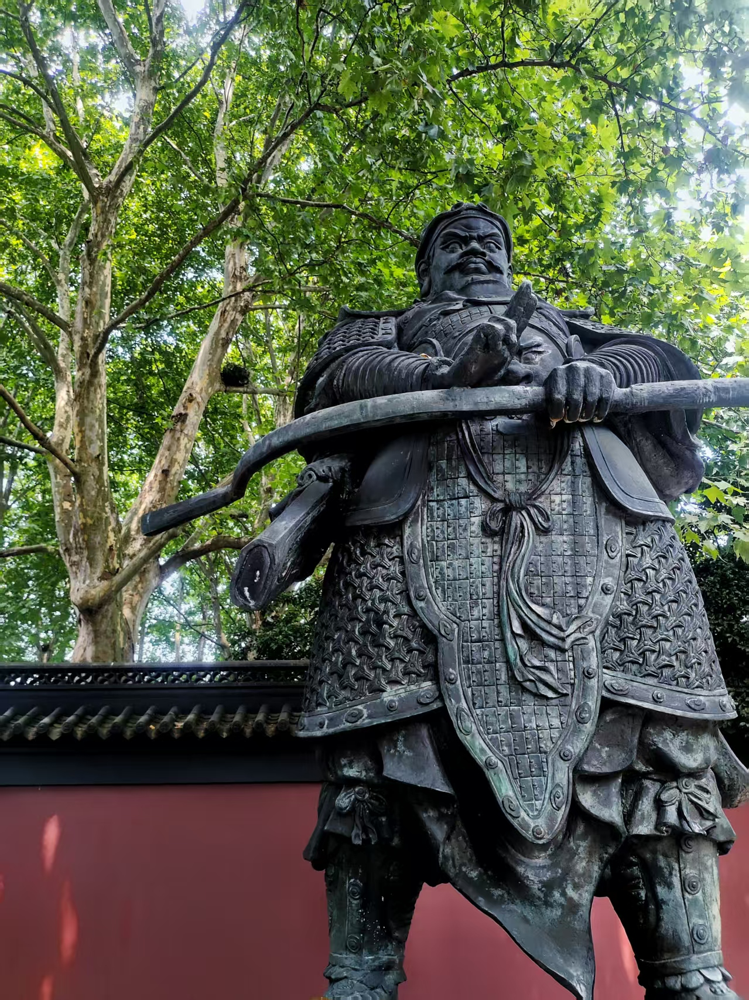

2023年6月15日，昨天刚爬完泰山，腿要废了。今天我就躺在火车卧铺上了，还是中间的，超级难受啊，我还不敢去泡泡面，就这样硬生生饿到了下火车。

17岁，什么也不靠，全靠顶级魔王护，拿下亚运会！
其实当时我就知道这个薪资对我来说起点太高了

这算是一个进入亚运会前必须通过的地方，我记得有一个像防空炮一样的空调，超级大！风力也老强！！

这是运动员的食堂，我们的食堂在地下，是的 地下 但也挺凉快的不是吗

ok啊!也是解锁人生中新的地图了，西湖！也就那样吧，不如洺湖

当时不知道这是谁，就拍了，后来知道这是钱王钱镠。

钱王也是好起来了，进我相册了。
